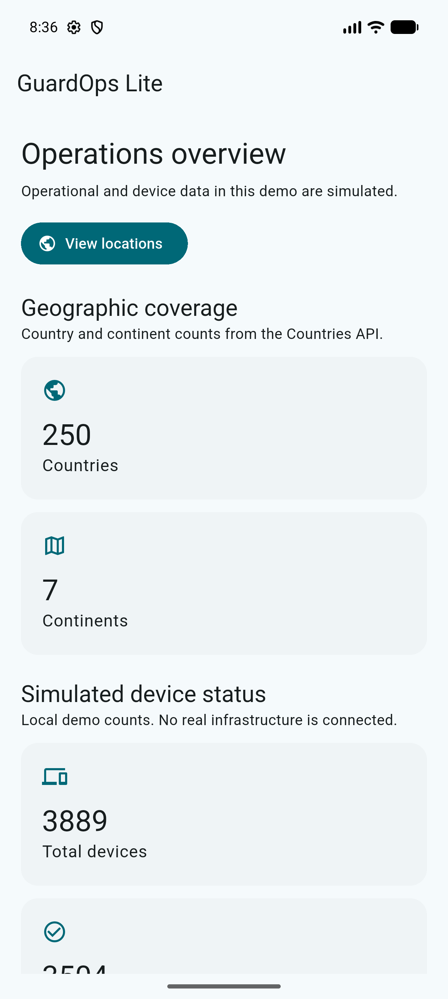
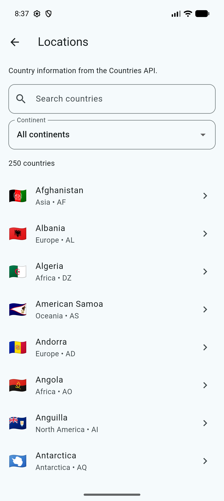
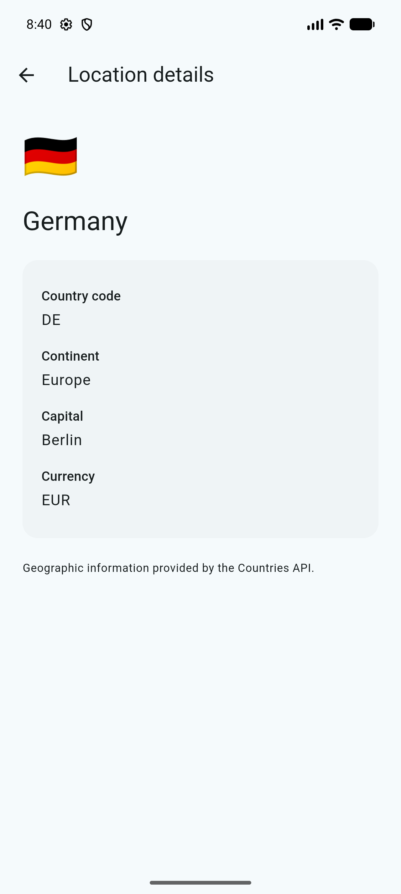

# GuardOps Lite

A Flutter portfolio application demonstrating an operations dashboard, live geographic data, and simulated device statistics using MVVM, BLoC, GraphQL, and constructor-based dependency injection.

## Download

**Latest Version: v1.1.0 — Continent Overview**

[Download Android APK (v1.1.0)](https://github.com/gurhangure/guardops-lite/releases/download/v1.1.0/GuardOps-Lite-v1.1.0.apk)

The APK can be installed directly on a compatible Android device without setting up a Flutter development environment.

> **Note:** This is a portfolio/demo application. The APK uses demo signing and is not intended for production or store distribution.

## Features

- Operations dashboard with API-derived geographic totals and simulated device status counts.
- Live Continent Overview displaying country distribution by continent.
- Dynamic horizontal distribution bars calculated from the complete Countries API dataset.
- Country search, continent filtering, and pull-to-refresh.
- Search and filter selections preserved after detail navigation.
- Country details fetched using a parameterized GraphQL query, including capital, currency, code, and continent.
- Loading, empty, error, and retry states.
- Previously loaded data retained when refresh fails.
- Material 3 layouts with automated small-screen, landscape, and enlarged-text coverage.

## Screenshots

Captured on a Pixel 10 Pro Android emulator using live Countries API data. Geographic counts reflect the capture date.

| Dashboard | Locations | Country Details |
| --- | --- | --- |
|  |  |  |

## Technology and Architecture

**Technology Stack**

- Flutter 3.47.2 / Dart 3.13.2
- MVVM Architecture
- BLoC State Management (`flutter_bloc`)
- GraphQL (`graphql_flutter`)
- Repository Pattern
- Constructor-based Dependency Injection
- Material 3
- Unit and Widget Testing
- GitHub Actions CI/CD

Dependency versions are recorded in `pubspec.lock`.

### Architecture Overview

MVVM is the primary architectural pattern. BLoCs fulfill ViewModel responsibilities without introducing additional ChangeNotifier-based ViewModels or unnecessary Domain/UseCase layers.

| Responsibility | Implementation |
| --- | --- |
| Model & Data Access | Immutable models; `LocationRepository` abstracts geographic data; `GraphQLLocationRepository` maps API responses and failures; `SimulatedOperationsRepository` generates repeatable local statistics. |
| ViewModel | `OperationsBloc` coordinates data loading, search, filtering, refresh, continent aggregation, and dashboard state. `LocationDetailBloc` manages individual country details and retry behavior. |
| View | Flutter screens render BLoC states and forward user interactions. Widgets do not perform direct GraphQL requests. |
| Dependency Injection | `AppDependencies` provides constructor-based dependency wiring and supports network-free automated tests. |

### Project Structure

```text
lib/
  core/
    di/            # Dependency injection
    graphql/       # GraphQL client and queries
    theme/         # Material 3 theme
  models/          # Geographic models and operational statistics
  repositories/    # GraphQL access and local simulation
  viewmodels/      # BLoCs, events, and presentation states
  views/           # Dashboard, locations, and detail screens
  app.dart         # Application and route composition
  main.dart        # Application entry point

test/
  helpers/         # Fake repositories and test fixtures
  repositories/    # Data mapping and failure tests
  viewmodels/      # State transitions and regression tests
  views/           # Widget and responsive navigation tests

.github/
  workflows/
    flutter.yml    # CI/CD pipeline

docs/
  screenshots/     # Public application screenshots
```

## GraphQL Integration

The application uses the public [Countries GraphQL API](https://countries.trevorblades.com/) to retrieve geographic information without requiring an API key.

- Countries and continents are loaded concurrently.
- Country details are retrieved using the parameterized `Country($code: ID!)` query.
- Responses are mapped into strongly typed, immutable Dart models.
- Network, GraphQL, and malformed-response failures are handled separately.
- Explicit loads use `FetchPolicy.noCache` and a 15-second request timeout.
- Search and continent filtering operate locally on the loaded dataset.
- Dashboard continent statistics are calculated dynamically from the complete country list.
- Previously loaded data remains available if a refresh fails.

The application does not implement persistent offline caching.

## Setup and Running

### Requirements

- Flutter 3.47.2 stable (Dart 3.13.2)
- Android Studio / Android SDK
- Compatible JDK (CI uses Java 17)
- Android emulator or physical Android device
- Internet connection for geographic data

### Installation

Clone the repository:

```bash
git clone https://github.com/gurhangure/guardops-lite.git
cd guardops-lite
```

Verify your Flutter environment:

```bash
flutter doctor
flutter doctor --android-licenses
```

Install dependencies using the committed lockfile:

```bash
flutter pub get --enforce-lockfile
```

Check available devices and run:

```bash
flutter devices
flutter run -d <device-id>
```

The retained target platforms are Android and iOS. Android is the verified delivery target; iOS has not received equivalent release validation.

Linux, macOS, Windows, and web runners are intentionally excluded.

## Verification and Testing

Run the complete local verification suite:

```bash
dart format lib test && flutter analyze && flutter test
```

GitHub Actions additionally verifies formatting without modifying source files:

```bash
dart format --output=none --set-exit-if-changed lib test
```

### Automated Test Coverage

**61 automated tests passing.**

Tests cover:

- GraphQL response mapping and typed failures.
- Immutable models and nullable fields.
- BLoC state transitions.
- Search and combined continent filtering.
- Dashboard statistics and continent aggregation.
- Concurrent loading and overlapping refresh requests.
- Retained data following refresh failures.
- Safe disposal during asynchronous operations.
- Country-detail navigation and retry behavior.
- Loading, empty, and error UI states.
- Responsive navigation across multiple viewport sizes and enlarged text scales.

Automated tests use injected fake repositories or mocked GraphQL transport and do not depend on live network requests.

## Release APK

Generate an Android release APK locally:

```bash
flutter build apk --release
```

Output:

```text
build/app/outputs/flutter-apk/app-release.apk
```

Alternatively, download the published APK directly:

[GuardOps Lite v1.1.0 — GitHub Release](https://github.com/gurhangure/guardops-lite/releases/tag/v1.1.0)

The demo APK uses an Android debug signing certificate. Production signing and store deployment are not configured.

No signing credentials are stored in the repository.

## CI/CD

The project includes an automated [Flutter CI workflow](.github/workflows/flutter.yml) powered by GitHub Actions.

The workflow runs on pushes and pull requests and performs the following operations:

1. Checkout repository.
2. Configure Java 17.
3. Set up Flutter 3.47.2.
4. Install dependencies using the enforced lockfile.
5. Verify Dart formatting.
6. Run static analysis.
7. Execute automated tests.
8. Build the Android release APK.
9. Upload the generated APK as a workflow artifact.

The workflow has been successfully verified on GitHub Actions, including all 61 automated tests, release APK generation, and artifact upload.

Workflow artifacts are retained for 14 days. The published GitHub Release provides a persistent download for v1.1.0.

The workflow uses read-only repository permissions and cancels superseded runs on the same ref. It does not automatically deploy to app stores or publish GitHub Releases.

## Simulation Disclaimer

**All operational/device statistics are simulated local demo data.**

Country codes are used to deterministically generate device counts for demonstration purposes.

The application does not connect to actual security systems, sensors, enterprise infrastructure, or physical operational devices.

Geographic information is retrieved from the public Countries API. A listed country does not indicate an actual operational deployment.
